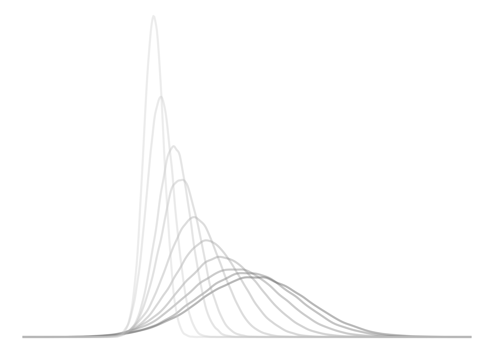

## **Some Bytes About Me**

Joshua Soboil enjoys problem solving and has developed a special love for evidence synthesis and advanced health economic decision-modelling techniques, using languages such as [BUGS](https://en.wikipedia.org/wiki/OpenBUGS)/[JAGS](https://en.wikipedia.org/wiki/Just_another_Gibbs_sampler) and [Stan](https://en.wikipedia.org/wiki/Stan_(software)) coupled with [R](https://en.wikipedia.org/wiki/R_(programming_language)).

For some added bytes, Joshua encourages the use of R for HTA. An extensive health economics R community has risen over the past several years. If you are interested, [BCEA](https://github.com/giabaio/BCEA) and [DARTH](https://github.com/DARTH-git) are great R packages that have been created for health economic decision-modelling. Also, R-HTA and DARTH are organisations which promote R and provide extensive tutorials on how to use the language for HTA. Josh's own work includes the ongoing development of a sensitivity analysis framework for Lower and Middle-Income Country (LMIC) HTA analysts. A case study to support the framework can be found [here](https://github.com/jSoboil/Dissertation). He is also also a founding member of [R-HTA in LMICs](https://twitter.com/rhta_lmics), an LMIC-focused chapter of the main R-HTA consortium. The chapter aims to introduce and showcase the strengths of R to HTA analysts and health institutions within LMICs.

### **Contact**
For inquiries, contact Joshua via [LinkedIn](https://www.linkedin.com/in/joshua-soboil-067351172/).