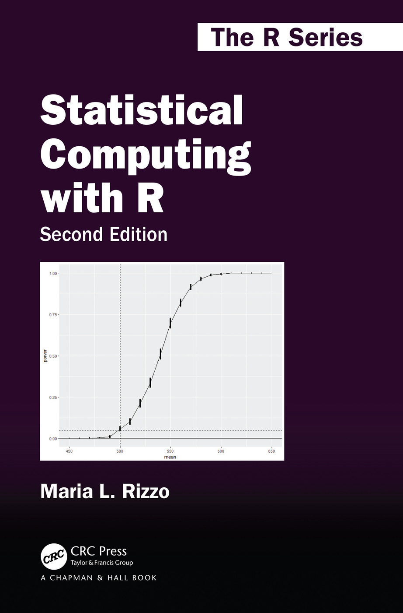
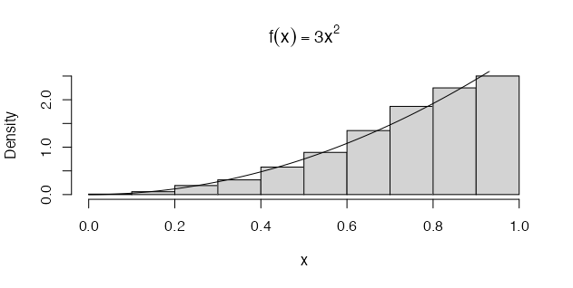

## **Rambles**
Some intermittent thoughts, primarily technical.

---

### Some basic simulation methods:
(27th Nov, 2021)



After my first post on the basic properties of numbers, I thought I'd delve into some basic simulation techniques that can be useful for health economic decision modelling. In conjunction with Spivak's 'Calculus', I am working through M. Rizzo's '[Statistical Computing with R](https://www.amazon.com/Statistical-Computing-Second-Chapman-Hall/dp/1466553324)', which showcases basic to advanced simulation methods for statistical computing. For example, one of the most basic methods for generating random variables is called the '[Inverse Transform](https://en.wikipedia.org/wiki/Inverse_transform_sampling)' method.

The inverse transform method for generating random variables is based on the following well-know result. If $$X$$ is a continuous random variable with cumulative density function (cdf) $$F_X(x)$$, then $$U = F_X(x) \sim Uniform(0, 1)$$. The inverse transform method then applies the [probability integral transformation](https://en.wikipedia.org/wiki/Probability_integral_transform), where the inverse transformation is defined as

$${F_x}^{-1}(u) = \inf{[x: F_X(x) = u]}, 0 < u < 1$$

Hence if $$U\sim Uniform(0, 1)$$, then for $$x \in \mathbb{R}$$:

$$P({F_x}^{-1}(U) \leq x) = P(\inf{[t: F_X(t) = U}] \leq x)$$

$$= P(U \leq F_{X}(x))$$

then

$$= F_{U}(F_{X}(x))$$

$$= F_{X}(x)$$

and therefore:

$$= {F_x}^{-1}(u)$$

which has the same distribution as $$X$$. Thus, this implies that to generate a 
random observation $$X$$, we can generate a simulated $$Uniform(0, 1)$$ variate $$y$$ and deliver the inverse value $${F_x}^{-1}(u)$$ before transforming to the desired cdf. Note that the method is easy to apply *provided* that the inverse density function is easy to compute.

**Some Simple Examples**
For instance, we can use the method to simulate a random sample from a distribution with the density $$f(x) = 3x^{2}$$, where $$0 < x < 1$$. Here the integral of the density function, or 'cumulative density', is simply $$F_{X}(x) = 3$$ for $$0 < x < 1$$ and $${F_x}^{-1}(u) = u^{1/3}$$. The result is coded and ploted below.

```{r}
n <- 1000
u <- runif(n)
x <- u ^ (1 / 3)
hist(x, probability = TRUE, main = expression(f(x) == 3 * x ^ 2)) # density hist of sample
y <- seq(0, 1, 0.1)
lines(y, 3 * y ^ 2) # density curve f(x) 
```



As shown by visual inspection of the plot to the left, the histogram and density plot (black line) suggest that the empirical and theoretical distributions *approximately* agree.

We can also apply the method to generate a random sample from the exponential distribution $$f(x) = \lambda\exp{-\lambda x}$$, with mean $$\frac{1}{\lambda}$$. If $$X \sim exp{\lambda}$$ then for $$x > 0$$ the cdf  is

$$F_{X}(x) = 1 - \exp^{-\lambda x}$$

The inverse transformation of the cdf is then

$$F_{X}^{-1}(u) = -(1/\lambda\times log(1 - u)$$

Note that $$U$$ and $$1 - U$$ have the same distribution and it is simpler to set $$x = -(1/\lambda) \times log(u)$$.

### Reflections on the basic properties of numbers:
(19th Nov, 2021)

There are things I wish I had learned in school. Maybe I wouldn't have understood it then due to my ADD which often got in the way of my intent focus. Perhaps it was the teacher who was boring. Truthfully, I often found myself thinking of other things besides mathematics, as you can imagine. Luckily, now that I am older I have unexpectedly developed a deep intrigue for mathematics, a tinkering obsession perhaps, and  my ability to appreciate some basic mathematical proofs has grown.

Hence, I am currently working through the 4th Ed. of Michael Spivak's [*'Calculus'*](https://www.amazon.com/Calculus-4th-Michael-Spivak/dp/0914098918). Spivak presents calculus beautifully, with great prose. Importantly, I think, is his implicit mathematical message: it is an art that rewards playfulness and tinkering. But, to return back to the point of this post (it's title), I thought it would be good to share and revise the 'basic properties of numbers' or, more specifically, the basic rules of arithmetic.

#### Property 1: the associative law for addition
If $$a$$, $$b$$, and $$c$$ are any numbers, then

$$a + (b+c) = (a+b) + c$$

#### Property 2: the existence of an additive identity
If $$a$$ is any number, then

$$a + 0 = 0 + a = a$$

Following from this, an important role is also played by 0 in the third property.

#### Property 3: the existence of additive inverses
For every number $$a$$, there is a number $$-a$$ such that

$$a + (-a) = (-a) + a = 0$$

Thus, additive inverses are simply the addition of the negative, i.e. $$+ (-a)$$. It is therefore convenient to regard subtraction as an operation derived from addition. This means $$a - b$$ is often an implicit abbreviation for $$a + (-b)$$. 

There now remains only one remaining property for basic addition.

#### Property 4: the commutative law for addition
If $$a$$ and $$b$$ are any numbers, then

$$a + b = b + a$$

which emphasises that the operation of addition of pairs of numbers does not depend on the order of the addition of these pairs. However, not all operations are alike, for example $$a - b \not= b - a$$. Interestingly, $$a - b = b - a$$ only when $$a = b$$!

However, to go further into arithmetic, into multiplication and division, we need a little more.

#### Property 5: the associative law for multiplication
Fortunately, Spivak notes, the basic properties of multiplication are so similar to those for addition that both the meaning and the consequences should be clear.

If $$a$$, $$b$$, and $$c$$ are any numbers, then

$$a\times (b\times c) = (a\times b)\times c$$

This leads to to the existence of an identity for multiplication rules...

#### Property 6: the existence of a multiplicative identity
If $$a$$ is any number, then

$$a\times 1 = 1\times a = a$$

Moreover,

$$1 \not= 0$$

As Spivak notes, this assertion may seem strange but it is important because it is not possible to prove the property otherwise. As below, $$\frac{a}{0}$$ is undefined, hence the assertion.

#### Property 7: the existence of multiplicative inverses
For every number $$a \not= 0$$, there is a number $$a^{-1}$$ such that

$$a\times a^{-1} = a^{-1}\times a = 1$$

In other words $$\frac{2}{2} = 1$$.

#### Property 8: the commutative law for multiplication
If $$a$$ and $$b$$ are any numbers, then

$$a\times b = b\times a$$

#### Property 9: the distributive law
Finally, if $$a$$, $$b$$, and $$c$$ are any numbers, then

$$a\times (b + c) = a\times b + a\times c$$

Notice that the equation $$(b + c)\times a = b\times a + c\times a$$ is also true according to P8. Notably, the importance of P9 is shown by determining why $$a - b = b - a$$ only holds when $$a = b$$:

If

$$a - b = b - a$$

then

$$(a - b) + b = (b - a) + b = b + (b - a)$$

hence

$$a = b + b - a$$

and so,

$$a + a = (b + b -a) + a = b + b$$

Consequently,

$$a\times (1 + 1) = b\times (1 + 1)$$

which, with some last bit of basic algebra balancing, shows that:

$$a = b$$

A further, second use of P9 is the justification of the assertion that $$a\times 0 = 0$$. First, we have

$$a\times 0 + a\times 0 = a\times (0 + 0)$$

$$ = a\times 0$$

which immediately implies (by adding $$-(a\times 0)$$ to both sides) that

$$a\times 0 = 0$$

Even more interesting, P9 can help explain why the product of two negative numbers is positive. To begin, we note that

$$ (-a)\times b + a\times b = [(-a) + a]\times b$$

$$ = 0\times b$$

$$ = 0$$

It then follows (by adding $$(-a\times b)$$ to both sides) that $$(-a)\times b = -(a\times b)$$. Now note that

$$(-a)\times (-b) + [-(a\times b)] = (-a)\times (-b) + (-a)\times b$$

$$ = (-a)\times [(-b) + b]$$

$$ = (-a)\times 0$$

$$ = 0$$

Consequently, by adding $$(a\times b)$$ to both sides, we obtain

$$(-a)\times (-b) = a\times b$$

Et voila!
