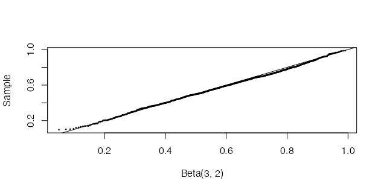
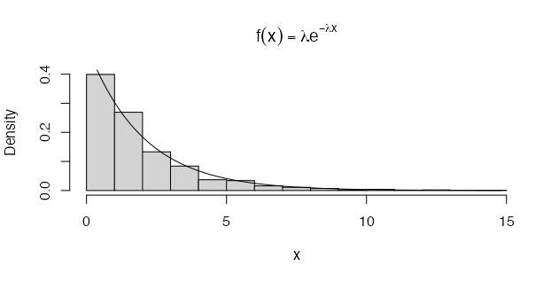

# **Rambles**

Some intermittent thoughts, primarily technical.

---

## Table of Contents
- [The Metropolis-Hastings Algorithm](#the-metropolis-hastings-algorithm)
<br>
- [The acceptance-rejection method](#the-acceptance-rejection-method)
<br>
- [Some basic simulation methods](#some-basic-simulation-methods)
<br>
- [Reflections on the basic properties of numbers](#reflections-on-the-basic-properties-of-numbers)
<br>

---
## The Metropolis-Hastings Algorithm
So, it's been a while since I last posted. Admittedly, I have been on a roller-coaster - a good one! I've moved to the United Kingdom. My wife and I have secured a beautiful apartment for the next two years, and I have accepted the position of Senior Analyst at [Cogentia Healthcare Consulting](https://cogentia.co.uk). Between that, and still trying to do some touristy things here and there - like visiting the beautiful Regent's Park (it was weird to hear lions roaring so far away from home) and the extremely busy Camden Market - I also managed to partake and complete the Bayesian Data Analysis course for 'global south' students, organised by Prof [Aki Vehtari](https://users.aalto.fi/~ave/). Yes, ***the guy who helped write BDA3***. Pretty cool!

I learnt a *lot* over the course of a few months, but one of the most interesting things for me was observing how almost every peer I reviewed had a *different way of solving the weekly problem*. I found it fascinating to see how my peers structured their code and layout of the problem differently, sometimes (often) thinking, "My god, that is an awesome and much more efficient way to do it!" One of the really cool technical things that I learnt directly from the course however, was explicitly writing my own Metropolis-Hastings Algorithm.

The Metropolis algorithm is a general term for a Markov chain simulation method that can be used to sample from Bayesian posterior distributions. Simply, given a posterior distribution that is not straightforward to sample from analytically, the Metropolis algorithm can approximate the posterior via information obtained from a ratio of symmetric densities. The central mechanic of the algorithm is the *jumping rule*.

The jumping rule assigns a new, *proposal* parameter value if a new, randomly sampled value induces a larger ratio between the target and proposal distribution compared to the previously sampled value (a larger value indicates that there is greater mass in the posterior at the new, proposed point). Specifically, this information is induced via the likelihoods (and priors) used to calculate the density ratio.

For instance, say we have some data that looks like this:
```r
      x n y
1 -0.86 5 0
2 -0.30 5 1
3 -0.05 5 3
4  0.73 5 5
```

Now, let's also assume a Gaussian prior with a certain mean and variance. That is,

\[
\begin{bmatrix}
\alpha\\
\beta
\end{bmatrix}
\sim N(\mu_{0}, \Sigma_{0})
\]  
and, moreover, that
\[
\mu_{0} = \begin{bmatrix}
0\\
10
\end{bmatrix}
\Sigma_{0} = \begin{bmatrix}
2^{2} &12\\
12&10^{2}\\
\end{bmatrix}
\]

Since the jumping rule is the crux of the algorithm, we need to develop a function which evaluates the ration of two density samples. We can do this as follows:
```r
# density ratio function:
density_ratio <- function(alpha_star = alpha_star, alpha = alpha, 
                          beta_star = beta_star, beta = beta, x = x, 
                          y = y, n = n) {
# create mu vector and sigma matrix for prior density
 mu <- c(0, 10)
 sigma_matrix <- matrix(data = c(4, 12, 12, 100), nrow = 2)
 # evaluate prior alpha, beta density
 pr_1 <- dmvnorm(x = c(alpha_star, beta_star), mean = mu, sigma = sigma_matrix)
 pr_0 <- dmvnorm(x = c(alpha, beta), mean = mu, sigma = sigma_matrix)
 # compute log-likelihood
 lp_1 <- bioassaylp(alpha = alpha_star, beta = beta_star, x = x, y = y, n = n)
 lp_0 <- bioassaylp(alpha = alpha, beta = beta, x = x, y = y, n = n)
 # compute posterior (sum of log-prior and log-likelihood)
 posterior_1 <- sum(log(pr_1) + lp_1)
 posterior_0 <- sum(log(pr_0) + lp_0)
 # exponentiate to transform to natural scale
 r <- exp((posterior_1) - (posterior_0))
 # return result
 return(r)
}
```
Note the use of the log-scale to transform interactions onto the additive scale for ease of computation.


## The acceptance-rejection method
Posted: (27th Dec, 2021)

After a much needed rest I am continuing on from my previous post, and review several other transformation methods for random sampling, including the [acceptance-rejection method](https://en.wikipedia.org/wiki/Rejection_sampling).

Most of the methods I have discussed so far (in this blog and the previous) are rather tedious and inefficient. Moreover, when dealing with high dimensions and parameter correlations in decision models, creating a fully-decision theoretic (comprehensive) model, using some type of Markov Chain Monte Carlo algorithm, is perhaps preferable given the potential efficiency advantages. Nevertheless, I believe that it is important to have a basic understanding of the more 'foundational' algorithms for random sampling, since many of these methods were borne from each other over time. In fact, the acceptance-rejection method provided some of the building blocks for other, more efficient Monte Carlo algorithms that rely on ideas such as proposal distributions, ratios, and acceptance thresholds - for example the [Metropolis algorithm](https://en.wikipedia.org/wiki/Metropolis_algorithm).

With that said, the basic idea of the acceptance-rejection method is as follows: suppose that $$X$$ and $$Y$$ are random variables with respective densities or masses $$f$$ and $$g$$, and there exists a normalising constant $$c$$, for all $$t$$ inputs given $$f(t) > 0$$, such that

$$\frac{f(t)}{g(t)} \leq c$$

which is a ratio of the outputs of the respective function compared to a constant, or 'threshold' value, $$c$$. Thus, it is important to find some $$c$$ that satisfies this condition to sample efficiently. The general goals of this method are, therefore, to satisfy the following:

1. First, find a random variable $$Y$$ with density $$g$$ satisfying $$\frac{f(t)}{g(t)} \leq c$$, for all $$t$$ such that $$f(t) > 0$$.

2. Second, for each random variate required:
- a) Generate a random $$y$$ from the distribution with density $$g$$
- b) Generate a random $$u$$ from the $$Uniform(0, 1)$$ distribution
- c) If $$u < \frac{f(y)}{cg(y)}$$, accept the sample $$y$$ and deliver $$x = y$$; otherwise reject $$y$$.

It is important to note in relation to step 2 c), that

$$P(accept | Y) = P(U < \frac{f(Y)}{cg(Y)} | Y) = \frac{f(Y)}{cg(Y)}$$

which is an inequality evaluating the cdf of $$U$$. The total probability of acceptance for any iteration, therefore, for all $$y$$ inputs is

$$P(accept | y) P(Y = y) = \frac{f(y)}{cg(y)} g(y) dy = \frac{1}{c}$$

which means that the number of iterations until acceptance for each sample has a geometric distribution with mean $$c$$. Hence, on average each sample value of $$X$$ requires $$c$$ iterations. Note that it is also handy to check that the accepted sample has the same distribution as $$X$$ by applying Bayes' theorem [1].

### Sampling from the Beta distribution:
To provide a clearer, more intuitive understanding, let's simulate 1000 variables from the $$Beta(\alpha = 2, \beta = 2)$$ distribution using the acceptance-rejection method [1].

Remember that the $$Beta$$ density is $$x^{\alpha - 1} (1 - x)^{\beta - 1}$$. If $$c = 6$$, the numerator of our ratio, in this example, is $$f(x) = 6x(1 - x)$$, where $$0 < x < 1$$. We then let $$g(x)$$ be a function with a $$Uniform(0, 1)$$ density. Then if:

$$\frac{f(x)}{g(x)} \leq 6$$ 

a random $$x$$ from $$g(x)$$ is accepted if

$$\frac{f(x)}{cg(x)} = \frac{6x(1 - x)}{6(1)} = x(1 - x) > u$$

The R code for this simulation is presented below [1].

```r
set.seed(41513)
n <- 1000
k <- 0 # number of accepted samples
y <- numeric(n)

while (k < n) {
 u <- runif(1)
 x <- runif(1) # sample random variate from g
 
 if (x * (1 - x) > u) {
  # accept sample x:
  k <- k + 1 # add + 1 to k if sample accepted
  y[k] <- x
 }
}

# Now we can compare the empirical and theoretical percentiles:
p <- seq(0.1, 0.9, 0.1)
Q_hat <- quantile(y, p)
Q <- qbeta(p, 2, 2)
se <- sqrt(p * (1 - p)) / (n * dbeta(Q, 2, 2) ^ 2)

# Below, the sample percentiles (first line) approximately match the Beta(2, 2)
# percentiles computed by qbeta (second line):
round(rbind(Q_hat, Q, se), 3)

# With the above set.seed value, this produces the following values:
        10%   20%   30%   40% 50%   60%   70%   80%   90%
Q_hat 0.186 0.287 0.351 0.422 0.5 0.570 0.643 0.718 0.830
Q     0.196 0.287 0.363 0.433 0.5 0.567 0.637 0.713 0.804
se    0.000 0.000 0.000 0.000 0.0 0.000 0.000 0.000 0.000
```

In addition to the above, it is important to know that there are several other types of methods that can be applied to generate random variables, all with their own assumptions. As noted in [1], some examples are

1. If $$Z \sim N(0, 1)$$, then $$V = Z^{2} \sim \chi^{2}(1)$$

2. If $$U \sim \chi^{2}(m)$$ and $$V \sim \chi^{2}(n)$$ are independent, then $$F = \frac{U/m}{V/n}$$ has the $$F$$ distribution with $$(m, n)$$ degrees of freedom

3. If $$Z \sim N(0, 1)$$ and $$V \sim \chi^{2}(n)$$ are independent, then $$T = \frac{Z}{\sqrt{V/n}}$$ has the Student $$t$$ distribution with $$n$$ degress of freedom

4. If $$U$$, $$V \sim Uniform(0, 1$$ are independent, then $$Z_{1} = \sqrt{-2 log U} cos(2\pi V)$$ and $$Z_{2} = \sqrt{-2 log U} sin(2\pi V)$$ are independent standard normal variables

5. If $$U \sim Gamma(r, \lambda)$$ and $$V \sim Gamma(s, \lambda)$$ are independent, then $$X = \frac{U}{U + V}$$ has the $$Beta(r, s)$$ distribution

6. If $$U$$, $$V \sim Uniform(0, 1)$$ are independent, then $$X = [1 + \frac{log(V)}{log(1 - (1 - \theta)^{U})}]$$ has the $$Logarithmic(\theta)$$ distribution, where $$ \lfloor x\rfloor$$ denotes the integer part of $$x$$

### The Relation Between the Beta and Gamma Distributions:
Based on example 5 above, we can show the neat relation between the $$Beta$$ and $$Gamma$$ distributions. As above, if $$U \sim Gamma(r, \lambda)$$ and $$V \sim Gamma(s, \lambda)$$ are independent, then

$$X = \frac{U}{U + V}$$

has the $$Beta(r, s)$$ distribution. This transformation determines an algorithm for generating random $$Beta(a, b)$$ variates. The algorithm is as follows:

1. Generate a random $$u$$ from $$Gamma(a, 1)$$

2. Generate a random $$v$$ from $$Gamma(b, 1)$$

3. Deliver $$x = \frac{u}{u + v}$$

An example of applying this method to generate a random $$Beta(3, 2)$$ sample is demonstrated, using R code, below [1]:

```r
set.seed(123)
n <- 1000
a <- 3
b <- 2
u <- rgamma(n, shape = a, rate = 1)
v <- rgamma(n, shape = b, rate = 1)
x <- u / (u + v)
```

The sample we generate can then be compared with the $$Beta(3, 2)$$ distribution using a quantile-quantile (QQ) plot [1]. If the sampled distribution is $$Beta(3, 2)$$, the QQ plot should be close to linear. This is confirmed by the plot below.

```r
q <- qbeta(ppoints(n), a, b)
qqplot(q, x, cex = 0.25, xlab = "Beta(3, 2)", ylab = "Sample")
abline(0, 1)
```

<p align="center">

</p>

I will continue my discussion methods for random sampling in my next post, focusing on methods for multivariate distributions, which have often been used in health economic decision modelling, such as Choleski factorisation.

Et voilà!

[1] Maria L. Rizzo. *Statistical Computing with R*. 2nd Ed. The R Series. CRC Press

---

## Some basic simulation methods 
Posted: (29th Nov, 2021)

After my first post on the basic properties of numbers, I thought I'd delve into some basic simulation techniques that can be useful for health economic decision modelling. In conjunction with Spivak's 'Calculus', I am working through M. Rizzo's ['Statistical Computing with R'](https://www.amazon.com/Statistical-Computing-Second-Chapman-Hall/dp/1466553324), which showcases basic to advanced simulation methods for statistical computing. For example, one of the most basic methods for generating random variables is called the '[Inverse Transform](https://en.wikipedia.org/wiki/Inverse_transform_sampling)' method.

The inverse transform method for generating random variables is based on the following well-known result. If $$X$$ is a continuous random variable with cumulative density function (cdf) $$F_X(x)$$, then $$U = F_X(x) \sim Uniform(0, 1)$$. The inverse transform method then applies the [probability integral transformation](https://en.wikipedia.org/wiki/Probability_integral_transform), where the inverse transformation is defined as

$${F_x}^{-1}(u) = \inf{[x: F_X(x) = u]}, 0 < u < 1$$

Hence if

$$U\sim Uniform(0, 1)$$

then for $$x \in \mathbb{R}$$

$$P({F_x}^{-1}(U) \leq x) = P(\inf{[t: F_X(t) = U}] \leq x)$$

$$= P(U \leq F_{X}(x))$$

then

$$F_{U}(F_{X}(x)) = F_{X}(x)$$

and, using the chain rule, we can prove that:

$$= {F_x}^{-1}(u)$$

which has the same distribution as $$X$$ [1]. Thus, this implies that to generate a random observation $$X$$, we can generate a simulated $$Uniform(0, 1)$$ variate $$y$$ to deliver the inverse value $${F_x}^{-1}(u)$$, before transforming to the desired cdf. Note that the method is easy to apply *provided* that the inverse density function is easy to compute [1].

<p>
</p>

### Some Simple Continuous Examples:
For instance, we can use the method to simulate a random sample from a distribution with the density $$f(x) = 3x^{2}$$, where $$0 < x < 1$$. Here the integral of the density function, or 'cumulative density', is simply $$F_{X}(x) = x^{3}$$ for $$0 < x < 1$$ and so $${F_x}^{-1}(u) = u^{\frac{1}{3}}$$ [1]. The result is coded and plotted below:

```r
n <- 1000
u <- runif(n)
x <- u ^ (1 / 3)
hist(x, probability = TRUE, main = expression(f(x) == 3 * x ^ 2)) # density hist of sample
y <- seq(0, 1, 0.01)
lines(y, 3 * y ^ 2) # density curve f(x) 
```

<p align="center">

</p>

From a simple visual inspection of the plot (above), we can observe that the histogram of $$u^{\frac{1}{3}}$$ and density plot of $$f(x) = 3x^{2}$$ (the black line) suggest that the empirical and theoretical distributions *approximately* agree.

We can also apply the method to generate a random sample from the exponential distribution $$f(x) = \lambda e^{-\lambda x}$$, with mean $$\frac{1}{\lambda}$$ [1]. For example, if $$X \sim Exp(\lambda)$$, for $$x_{i} > 0$$, the cdf is

$$F_{X}(x) = 1 - e^{-\lambda x}$$

The inverse transformation of the cdf is then

$$F_{X}^{-1}(u) = -(\frac{1}{\lambda}) \times log(1 - u)$$

Note: $$U$$ and $$1 - U$$ have the same distribution and so it is simpler to set $$x = -(\frac{1}{\lambda}) \times log(u)$$ [1]. The R code to generate To generate a random sample of size $$n$$ and parameter $$\lambda$$ is demonstrated below:

```r
n <- 1000
lambda <- 0.5 # set lambda (mean) constant, i.e. E[X] = 1 / lambda
x <- (-log(runif(n)) / lambda)
hist(x, probability = TRUE, main = expression(
 f(x) == lambda * e ^ {-lambda * x}))
y <- seq(min(x), max(x), 0.1)
lines(y, lambda * exp(-lambda * y)) # density curve f(x)
```

<p align="center">

</p>

The method can also be applied to the discrete case, but it is slightly different and one has to specify discontinuities - to 'split' the samples into bins. If $$X$$ is a discrete random variable and $$... < x_{i-1} < x_{i} < x_{i + 1} < ...$$ are the points of discontinuity of $$F_{X}(u)$$, then the inverse transformation is $$F_{X}^{-1}(u) = x_{i}$$, where $$F_{X}(x_{i - 1}) < u \leq F_{X}(x_{i})$$ [1]. So, for each random variate required, we need to:

1. Generate a random $$u$$ from $$Uniform(0, 1)$$

2. Deliver $$x_{i}$$ where $$F(x_{i - 1}) < u \leq F(x_{i})$$

<p>
</p>

### Some Simple Discrete Examples:
In this example, we generate to a random sample of $$Bernoulli(p = 0.4)$$ variates for $$F_{X}(0) = f_{X}(0) = 1 - p$$ and $$F_{X}(1) = 1$$ where $$F_{X}^{-1}(u) = 1$$ if $$u > 0.6$$ and $$F_{X}^{-1}(u) = 0$$ if $$u \leq 0.6$$. The generator should therefore deliver the numerical value of the logical expression which we specify, which in this example is $$u > 0.6$$ [1]:

```r
set.seed(300)
n <- 1000
p <- 0.4
u <- runif(n)
x <- as.integer(u > 0.6)
mean(x)
```

With a <tt>set.seed()</tt> value of <tt>300</tt>, the above algorithm returns an expected value of $$E[X > 0.6] \approx 0.443$$. Another example, which requires a more complicated function, is to simulate a $$Logarithmic(\theta)$$ sample. A random variable $$X$$ has the logarithmic distribution if

$$f(x) = P(X = x) = \frac{a \theta^{x}}{x}, x = 1, 2, ...$$

where

$$0 < \theta < 1$$

and

$$a = (-\log(1 - \theta))^{-1}$$

A recursive formulae for $$f(x)$$, where $$x = 1, 2, ...$$, is

$$f(x + 1) = \frac{\theta^{x}}{x + 1} f(x)$$

Theoretically, the probability mass function (pmf) can be evaluated recursively using the above equation, but the calculation is not sufficient for large values of $$x$$ and ultimately produces $$f(x) = 0$$ with $$F(x) < 1$$ [1]. Instead, we can compute the pmf from the non-recursive equation as $$e^{(\log a + x \log \theta - \log x)}$$. In generating a large sample, there will be many repetitive calculations of the same values $$F(x)$$ [1]. It is more efficient to store the cdf values. Initially, we must therefore choose a length $$N$$ for the cdf vector, and compute $$F(x)$$ where $$x = 1, 2, ..., N$$ [1]. If necessary $$N$$ will thus be increased.

To solve $$F(x - 1) < u \leq F(x)$$ for a particular $$u$$, it is necessary to count the number of values $$x$$ such that $$F(x - 1) < u$$. If $$F$$ is a vector and $$u_i$$ is a scalar, then the expression $$F < u_i$$ produces a logical vector; that is, a vector of the same length as $$F$$ containing boolean/logical <tt>TRUE</tt> or <tt>FALSE</tt> values. Notice that the sum of the logical vector $$(u_i > F)$$ is exaclty $$x - 1$$ [1]. The function is written in R below:

```r
rlogarithmic <- function(n, theta) {
 # returns a random logarithmic(theta) sample size n:
 u <- runif(n)
 # set the initial length of the cdf vector:
 N <- ceiling(-16 / log10((theta)))
 k <- 1:N
 a <- -1 / log(1 - theta)
 fk <- exp(log(a) + k * log(theta) - log(k))
 Fk <- cumsum(fk)
 x <- integer(n)
 for (i in 1:n) {
  x[i] <- as.integer(sum(u[i] > Fk)) #F^{-1}(u) = 1
  while (x[i] == N) {
   # if x == N we need to extend the cdf
   logf <- log(a) + (N + 1) * log(theta) - log(N + 1)
   fk <- c(fk, exp(logf))
   N <- N + 1
   x[i] <- as.integer(sum(u[i] > Fk))
  }
 }
 x + 1
}
```

Using the above function, we can then generate random samples from the $$Logarithmic(0.5)$$ distribution:

```r
n <- 1000
theta <- 0.5
x <- rlogarithmic(n = n, theta = theta)
k <- sort(unique(x))
p <- -1 / log(1 - theta) * theta ^ k / k
se <- sqrt(p * (1 - p) / n)
```

This is much more efficiently implemented using the acceptance-rejection method however, which will be the topic of my next post.

Et voilà!

**References:**

[1] Maria L. Rizzo. *Statistical Computing with R*. 2nd Ed. The R Series. CRC Press

---

## Reflections on the basic properties of numbers
Posted: (19th Nov, 2021)

There are things I wish I had learned in school. Maybe I wouldn't have understood it then due to my ADD which often got in the way of my intent focus. Perhaps it was the teacher who was boring. Truthfully, I often found myself thinking of other things besides mathematics, as you can imagine. Luckily, now that I am older I have unexpectedly developed a deep intrigue for mathematics, a tinkering obsession perhaps, and  my ability to appreciate some basic mathematical proofs has grown.

Hence, I am currently working through the 4th Ed. of Michael Spivak's [*'Calculus'*](https://www.amazon.com/Calculus-4th-Michael-Spivak/dp/0914098918). Spivak presents calculus beautifully, with great prose. Importantly, I think, is his implicit mathematical message: it is an art that rewards playfulness and tinkering. But, to return back to the point of this post (it's title), I thought it would be good to share and revise the 'basic properties of numbers' or, more specifically, the basic rules of arithmetic.

### Property 1: the associative law for addition
If $$a$$, $$b$$, and $$c$$ are any numbers, then

$$a + (b+c) = (a+b) + c$$

### Property 2: the existence of an additive identity
If $$a$$ is any number, then

$$a + 0 = 0 + a = a$$

Following from this, an important role is also played by 0 in the third property.

### Property 3: the existence of additive inverses
For every number $$a$$, there is a number $$-a$$ such that

$$a + (-a) = (-a) + a = 0$$

Thus, additive inverses are simply the addition of the negative, i.e. $$+ (-a)$$. It is therefore convenient to regard subtraction as an operation derived from addition. This means $$a - b$$ is often an implicit abbreviation for $$a + (-b)$$. 

There now remains only one remaining property for basic addition.

### Property 4: the commutative law for addition
If $$a$$ and $$b$$ are any numbers, then

$$a + b = b + a$$

which emphasises that the operation of addition of pairs of numbers does not depend on the order of the addition of these pairs. However, not all operations are alike, for example $$a - b \not= b - a$$. Interestingly, $$a - b = b - a$$ only when $$a = b$$!

However, to go further into arithmetic, into multiplication and division, we need a little more.

### Property 5: the associative law for multiplication
Fortunately, Spivak notes, the basic properties of multiplication are so similar to those for addition that both the meaning and the consequences should be clear.

If $$a$$, $$b$$, and $$c$$ are any numbers, then

$$a\times (b\times c) = (a\times b)\times c$$

This leads to to the existence of an identity for multiplication rules...

### Property 6: the existence of a multiplicative identity
If $$a$$ is any number, then

$$a\times 1 = 1\times a = a$$

Moreover,

$$1 \not= 0$$

As Spivak notes, this assertion may seem strange but it is important because it is not possible to prove the property otherwise. As below, $$\frac{a}{0}$$ is undefined, hence the assertion.

### Property 7: the existence of multiplicative inverses
For every number $$a \not= 0$$, there is a number $$a^{-1}$$ such that

$$a\times a^{-1} = a^{-1}\times a = 1$$

In other words $$\frac{2}{2} = 1$$.

### Property 8: the commutative law for multiplication
If $$a$$ and $$b$$ are any numbers, then

$$a\times b = b\times a$$

### Property 9: the distributive law
Finally, if $$a$$, $$b$$, and $$c$$ are any numbers, then

$$a\times (b + c) = a\times b + a\times c$$

Notice that the equation $$(b + c)\times a = b\times a + c\times a$$ is also true according to P8. Notably, the importance of P9 is shown by determining why $$a - b = b - a$$ only holds when $$a = b$$:

If

$$a - b = b - a$$

then

$$(a - b) + b = (b - a) + b = b + (b - a)$$

hence

$$a = b + b - a$$

and so,

$$a + a = (b + b -a) + a = b + b$$

Consequently,

$$a\times (1 + 1) = b\times (1 + 1)$$

which, with some last bit of basic algebra balancing, shows that:

$$a = b$$

A further, second use of P9 is the justification of the assertion that $$a\times 0 = 0$$. First, we have

$$a\times 0 + a\times 0 = a\times (0 + 0)$$

$$ = a\times 0$$

which immediately implies (by adding $$-(a\times 0)$$ to both sides) that

$$a\times 0 = 0$$

Even more interesting, P9 can help explain why the product of two negative numbers is positive. To begin, we note that

$$ (-a)\times b + a\times b = [(-a) + a]\times b$$

$$ = 0\times b$$

$$ = 0$$

It then follows (by adding $$(-a\times b)$$ to both sides) that $$(-a)\times b = -(a\times b)$$. Now note that

$$(-a)\times (-b) + [-(a\times b)] = (-a)\times (-b) + (-a)\times b$$

$$ = (-a)\times [(-b) + b]$$

$$ = (-a)\times 0$$

$$ = 0$$

Consequently, by adding $$(a\times b)$$ to both sides, we obtain

$$(-a)\times (-b) = a\times b$$

Et voilà!
